# 🧭 10장. 파이썬과 MySQL 연동

## ✅ 학습 목표

- 데이터베이스와 SQL 기본 개념을 이해한다.
- MySQL을 설치하고 데이터베이스/테이블을 만들 수 있다.
- 파이썬에서 `mysql-connector-python` 모듈을 사용해 **연결, 데이터 저장/조회**를 수행한다.
- SQL의 기본 구조와 파이썬의 연동 방식을 함께 익힌다.

## 📘 전체 구성안

| 절차 | 단원 제목                       | 주요 내용                             |
| ---- | ------------------------------- | ------------------------------------- |
| 10-1 | 데이터베이스란?                 | DB, RDB, MySQL 개념, SQL이란          |
| 10-2 | MySQL 설치 및 설정              | Windows/Mac 설치 안내, 기본 명령어    |
| 10-3 | 데이터베이스와 테이블 만들기    | `CREATE DATABASE`, `CREATE TABLE` 등  |
| 10-4 | 파이썬에서 MySQL 연결           | `mysql-connector-python` 설치 및 연결 |
| 10-5 | INSERT 쿼리 – 데이터 저장       | 파이썬 입력값을 DB에 저장             |
| 10-6 | SELECT 쿼리 – 데이터 조회       | `fetchone()`, `fetchall()` 사용법     |
| 10-7 | UPDATE, DELETE – 수정/삭제      | 조건 기반 수정 및 삭제 쿼리           |
| 10-8 | 예외 처리와 with문              | 연결 오류 대비 및 자동 닫기           |
| 10-9 | 실습 프로젝트 – 회원관리 시스템 | 가입, 조회, 수정, 삭제를 통합 구현    |

## 🧩 주요 키워드

- **데이터베이스(Database)**, **테이블(Table)**, **SQL(쿼리문)**
- `CREATE`, `INSERT`, `SELECT`, `UPDATE`, `DELETE`
- `mysql.connector.connect()`
- `cursor.execute()`, `fetchall()`, `commit()`

## 💡 예시 중심 구성

- 파이썬 입력값을 회원 정보로 DB에 저장
- 조회 결과를 `for`문으로 출력
- 조건 검색(이름/ID 기준)
- 에러 발생 시 사용자 메시지 출력
- 입력값을 `input()`으로 받거나 `faker`로 생성

---

# 🧾 10-1. 데이터베이스란?

## 📌 데이터베이스(Database)란?

> **많은 데이터를 체계적으로 저장하고, 쉽게 꺼내 쓸 수 있도록 해주는 공간**
> 엑셀처럼 보이지만, 훨씬 강력하고, 다중 사용자, 프로그램, 서버에서도 동시에 사용 가능

## ✅ 데이터베이스의 종류

| 구분             | 설명                                       | 예시                              |
| ---------------- | ------------------------------------------ | --------------------------------- |
| **RDB** (관계형) | 표 형식(행-열)으로 데이터를 저장. SQL 사용 | MySQL, PostgreSQL, Oracle, SQLite |
| **NoSQL**        | 비정형 데이터, 유연한 구조                 | MongoDB, Redis 등                 |

> 이번에는 **MySQL (관계형 데이터베이스)**를 사용합니다.

## ✅ 테이블(Table)이란?

- 하나의 **표 형식 구조**
- 행(Row)은 한 개의 데이터
- 열(Column)은 속성 (이름, 나이, 주소 등)

🎯 예시: 회원 테이블

| id  | name   | email            |
| --- | ------ | ---------------- |
| 1   | 홍길동 | hong@example.com |
| 2   | 김영희 | kim@naver.com    |

## ✅ SQL이란?

> Structured Query Language
> 데이터베이스와 **대화하는 언어**. 데이터를 추가, 조회, 수정, 삭제하는 데 사용합니다.

### 🔹 대표 SQL 명령어

| 명령어         | 설명        |
| -------------- | ----------- |
| `CREATE TABLE` | 테이블 생성 |
| `INSERT INTO`  | 데이터 저장 |
| `SELECT`       | 데이터 조회 |
| `UPDATE`       | 데이터 수정 |
| `DELETE`       | 데이터 삭제 |

## ✅ 데이터베이스의 흐름 구조

```mermaid
flowchart LR
  A[파이썬] --> B[MySQL 연결]
  B --> C[SQL 쿼리 실행]
  C --> D[데이터 저장/조회]
  D --> A
```



---

# 🧾 10-2. MySQL 설치 및 기본 사용법

## ✅ MySQL 설치 (운영체제별 요약)

### 💻 Windows

1. MySQL 공식 홈페이지 접속:
   [https://dev.mysql.com/downloads/installer/](https://dev.mysql.com/downloads/installer/)

2. **MySQL Installer (Windows용)** 다운로드
   → Full 버전 또는 Web 버전 선택

3. 설치 중 구성 요소 선택:

   - MySQL Server
   - MySQL Workbench (GUI 도구, 선택 가능)

4. **root 비밀번호 설정**

5. 포트는 기본값 3306 유지

6. 설치 완료 후 `MySQL Command Line Client` 실행

### 🍎 macOS (Homebrew 사용)

```bash
brew install mysql
brew services start mysql
mysql -u root
```

🔐 root 초기 비밀번호 없이 접속되는 경우도 있음.
설정 시 `ALTER USER` 명령어로 비밀번호 설정 가능.

## ✅ MySQL 접속 및 기본 명령어

### MySQL 접속하기

```bash
mysql -u root -p
```

> `-u`는 사용자 이름, `-p`는 비밀번호 입력

### 기본 명령어 요약

| 명령어                    | 설명                 |
| ------------------------- | -------------------- |
| `SHOW DATABASES;`         | DB 목록 보기         |
| `CREATE DATABASE sample;` | sample이라는 DB 생성 |
| `USE sample;`             | 해당 DB 선택         |
| `SHOW TABLES;`            | 테이블 목록 보기     |
| `CREATE TABLE ...`        | 테이블 생성          |
| `INSERT INTO ...`         | 데이터 삽입          |
| `SELECT * FROM ...`       | 데이터 조회          |

## ✅ 실습: 간단한 테이블 만들기

```sql
CREATE DATABASE myapp;
USE myapp;

CREATE TABLE users (
    id INT AUTO_INCREMENT PRIMARY KEY,
    name VARCHAR(50),
    email VARCHAR(100)
);
```

## ✅ 데이터 삽입 및 조회 예시

```sql
INSERT INTO users (name, email) VALUES ('홍길동', 'hong@example.com');

SELECT * FROM users;
```

출력:

```
+----+--------+--------------------+
| id | name   | email              |
+----+--------+--------------------+
|  1 | 홍길동 | hong@example.com   |
+----+--------+--------------------+
```

---

# 🧾 10-3. 데이터베이스와 테이블 만들기

## ✅ 목표

- 데이터베이스 생성
- 회원 정보를 저장할 테이블 생성
- 주요 SQL 문법(`CREATE`, `DESC`, `DROP`) 익히기

## ✅ 1. 데이터베이스 생성

```sql
CREATE DATABASE pyuserdb DEFAULT CHARACTER SET utf8mb4 COLLATE utf8mb4_general_ci;
```

- 이름: `pyuserdb` (파이썬 연동 전용 DB)
- `utf8mb4`: 한글, 이모지 등 폭넓게 지원

```sql
USE pyuserdb;
```

## ✅ 2. 테이블 설계 및 생성

### 📌 회원 테이블 예시: `users`

```sql
CREATE TABLE users (
    id INT AUTO_INCREMENT PRIMARY KEY,
    name VARCHAR(30) NOT NULL,
    email VARCHAR(100) UNIQUE,
    age INT,
    created_at DATETIME DEFAULT CURRENT_TIMESTAMP
);
```

| 컬럼명       | 타입     | 설명                        |
| ------------ | -------- | --------------------------- |
| `id`         | INT      | 고유번호, 자동 증가         |
| `name`       | VARCHAR  | 이름 (필수)                 |
| `email`      | VARCHAR  | 이메일 (중복 불가)          |
| `age`        | INT      | 나이 (선택)                 |
| `created_at` | DATETIME | 가입 시간, 기본값 자동 설정 |

## ✅ 3. 테이블 구조 확인

```sql
DESC users;
```

또는:

```sql
SHOW COLUMNS FROM users;
```

## ✅ 4. 샘플 데이터 삽입

```sql
INSERT INTO users (name, email, age) VALUES
('홍길동', 'hong@example.com', 25),
('김영희', 'kim@example.com', 32);
```

## ✅ 5. 데이터 조회

```sql
SELECT * FROM users;
```

출력 예:

```
+----+--------+--------------------+-----+---------------------+
| id | name   | email              | age | created_at          |
+----+--------+--------------------+-----+---------------------+
|  1 | 홍길동 | hong@example.com   |  25 | 2025-07-04 14:01:02 |
|  2 | 김영희 | kim@example.com    |  32 | 2025-07-04 14:02:10 |
+----+--------+--------------------+-----+---------------------+
```

## ✅ 6. 테이블 삭제 (주의!)

```sql
DROP TABLE users;
```

> 실습 후 초기화하거나 실수로 삭제할 수 있으니 **꼭 확인 후 사용**!

---

# 🧾 10-4. 파이썬에서 MySQL 연결하기

## ✅ 필요한 외부 모듈: `mysql-connector-python`

> 파이썬에서 MySQL에 접속할 수 있도록 도와주는 커넥터(연결 도구)

## ✅ 설치 방법

```bash
pip install mysql-connector-python
```

## ✅ 기본 연결 코드

```python
import mysql.connector

conn = mysql.connector.connect(
    host="localhost",
    user="root",
    password="비밀번호",
    database="pyuserdb"
)

print("✅ MySQL 연결 성공!")

conn.close()
```

- `host`: 보통 로컬 개발 환경은 `"localhost"`
- `user`: 보통 `root`
- `password`: 설치 시 설정한 root 비밀번호
- `database`: 앞에서 만든 `pyuserdb`

## ✅ 연결 시 예외 처리 추가하기

```python
import mysql.connector
from mysql.connector import Error

try:
    conn = mysql.connector.connect(
        host="localhost",
        user="root",
        password="비밀번호",
        database="pyuserdb"
    )
    if conn.is_connected():
        print("✅ 연결 완료!")

except Error as e:
    print("❌ 연결 실패:", e)

finally:
    if conn.is_connected():
        conn.close()
        print("🔌 연결 종료")
```

## ✅ 연결 흐름 구조도

```mermaid
flowchart LR
  A[파이썬 코드 실행] --> B[mysql.connector.connect()]
  B --> C{연결 성공?}
  C -- 예 --> D[작업 수행]
  C -- 아니오 --> E[예외 처리]
  D --> F[conn.close()]
```

## ✅ 잘 연결되었는지 확인해볼 코드

```python
cursor = conn.cursor()
cursor.execute("SELECT DATABASE();")
row = cursor.fetchone()
print("현재 연결된 DB:", row)
```

---

# 🧾 10-5. INSERT 쿼리 – 데이터 저장하기

## ✅ 기본 흐름

1. 사용자에게 입력값 받기 (`input`)
2. SQL `INSERT INTO` 문 작성
3. 커서(cursor)를 이용해 SQL 실행
4. `commit()`으로 DB에 저장 확정
5. 연결 종료

## ✅ 예제: 사용자 정보 입력 후 DB에 저장

```python
import mysql.connector
from mysql.connector import Error

try:
    conn = mysql.connector.connect(
        host="localhost",
        user="root",
        password="비밀번호",
        database="pyuserdb"
    )
    if conn.is_connected():
        print("✅ DB 연결 성공")

        name = input("이름 입력: ")
        email = input("이메일 입력: ")
        age = int(input("나이 입력: "))

        sql = "INSERT INTO users (name, email, age) VALUES (%s, %s, %s)"
        values = (name, email, age)

        cursor = conn.cursor()
        cursor.execute(sql, values)
        conn.commit()  # 저장 확정

        print("✅ 저장 완료!")

except Error as e:
    print("❌ 에러 발생:", e)

finally:
    if conn.is_connected():
        cursor.close()
        conn.close()
        print("🔌 연결 종료")
```

### ✅ 중요한 포인트: `%s` 사용

- SQL 문법에 값을 직접 넣지 않고 **파라미터 바인딩** 방식 사용
- 보안상 안전 (SQL Injection 방지)
- 문자열, 숫자 모두 `%s`로 작성하고, **값은 튜플로 전달**

## ✅ 입력 예시

```
이름 입력: 이몽룡
이메일 입력: mong@example.com
나이 입력: 22
```

DB 저장 결과:

```sql
SELECT * FROM users;
```

```
+----+--------+---------------------+-----+---------------------+
| id | name   | email               | age | created_at          |
+----+--------+---------------------+-----+---------------------+
|  3 | 이몽룡 | mong@example.com    |  22 | 2025-07-04 15:10:45 |
+----+--------+---------------------+-----+---------------------+
```

## 💡 연습 과제 아이디어

- 사용자 정보를 3명 이상 반복 입력받아 저장하기 (`for`, `while`)
- `faker` 모듈을 활용한 더미 데이터 자동 삽입
- 이메일 중복 검사 후 저장 여부 확인 (`SELECT`로 먼저 검사)

---

# 🧾 10-6. SELECT 쿼리 – 데이터 조회하기

## ✅ 기본 흐름

1. DB 연결
2. SELECT 쿼리 실행
3. `fetchall()` 또는 `fetchone()`으로 결과 가져오기
4. 반복문으로 출력
5. 연결 종료

## ✅ 예제: 전체 회원 조회하기

```python
import mysql.connector

conn = mysql.connector.connect(
    host="localhost",
    user="root",
    password="비밀번호",
    database="pyuserdb"
)

cursor = conn.cursor()

cursor.execute("SELECT * FROM users")
rows = cursor.fetchall()  # 모든 결과 가져오기

for row in rows:
    print(row)

cursor.close()
conn.close()
```

출력 예시:

```
(1, '홍길동', 'hong@example.com', 25, datetime.datetime(2025, 7, 4, 14, 1, 2))
(2, '김영희', 'kim@example.com', 32, datetime.datetime(2025, 7, 4, 14, 2, 10))
```

## ✅ 컬럼별 출력 형식 (가독성 향상)

```python
for row in rows:
    print(f"ID: {row[0]}, 이름: {row[1]}, 이메일: {row[2]}, 나이: {row[3]}")
```

## ✅ 조건 검색: 이름으로 검색

```python
name = input("검색할 이름: ")

sql = "SELECT * FROM users WHERE name = %s"
cursor.execute(sql, (name,))
result = cursor.fetchall()

if result:
    for row in result:
        print(row)
else:
    print("해당 사용자가 없습니다.")
```

## ✅ fetch 종류 정리

| 함수           | 설명                           |
| -------------- | ------------------------------ |
| `fetchone()`   | 결과 중 첫 번째 행만 가져옴    |
| `fetchall()`   | 결과 전부 가져옴 (리스트 형태) |
| `fetchmany(n)` | n개만 가져옴                   |

## ✅ 예외 처리 포함 전체 예제

```python
from mysql.connector import connect, Error

try:
    conn = connect(
        host="localhost",
        user="root",
        password="비밀번호",
        database="pyuserdb"
    )

    cursor = conn.cursor()
    cursor.execute("SELECT * FROM users")
    for row in cursor.fetchall():
        print(f"[{row[0]}] {row[1]} / {row[2]} / {row[3]}세")

except Error as e:
    print("DB 오류:", e)

finally:
    if conn.is_connected():
        cursor.close()
        conn.close()
```

### 💡 딕셔너리 형태로 결과 받기

```python
cursor = conn.cursor(dictionary=True)
cursor.execute("SELECT * FROM users")
for row in cursor.fetchall():
    print(f"이름: {row['name']}, 이메일: {row['email']}")
```

---

# 🧾 10-7. UPDATE, DELETE – 데이터 수정과 삭제

## ✅ UPDATE (수정하기)

> 이미 존재하는 데이터를 **조건에 따라 변경**할 수 있습니다.

### ✅ 예제: 이메일 주소 변경

```python
import mysql.connector

conn = mysql.connector.connect(
    host="localhost",
    user="root",
    password="비밀번호",
    database="pyuserdb"
)

cursor = conn.cursor()

user_id = int(input("수정할 사용자 ID 입력: "))
new_email = input("새 이메일 입력: ")

sql = "UPDATE users SET email = %s WHERE id = %s"
cursor.execute(sql, (new_email, user_id))
conn.commit()

print("✅ 수정 완료!")

cursor.close()
conn.close()
```

## ✅ DELETE (삭제하기)

> 특정 조건을 만족하는 행(row)을 **영구적으로 제거**합니다.
> 주의: 한번 삭제하면 되돌릴 수 없습니다.

### ✅ 예제: 사용자 삭제

```python
conn = mysql.connector.connect(
    host="localhost",
    user="root",
    password="비밀번호",
    database="pyuserdb"
)

cursor = conn.cursor()

user_id = int(input("삭제할 사용자 ID 입력: "))

sql = "DELETE FROM users WHERE id = %s"
cursor.execute(sql, (user_id,))
conn.commit()

print("🗑️ 삭제 완료!")

cursor.close()
conn.close()
```

## ✅ 안전한 삭제 예제 (확인 후)

```python
confirm = input("정말 삭제하시겠습니까? (y/n): ")
if confirm.lower() == "y":
    cursor.execute("DELETE FROM users WHERE id = %s", (user_id,))
    conn.commit()
    print("삭제 완료!")
else:
    print("삭제 취소")
```

## ✅ 주의 사항

| 주의점               | 설명                                                               |
| -------------------- | ------------------------------------------------------------------ |
| `WHERE` 절 생략 금지 | `UPDATE`, `DELETE`에 `WHERE` 안 쓰면 **전체 데이터가 변경/삭제됨** |
| `commit()` 필수      | 실제 반영되려면 commit() 호출해야 함                               |
| `rollback()`         | 실수로 실행한 경우 되돌리는 기능 (트랜잭션 시 활용)                |

### 💡 영향받은 행 수 확인

```python
cursor.execute("UPDATE users SET email = %s WHERE id = %s", (new_email, user_id))
print(f"{cursor.rowcount}건 변경됨")
```

---

# 🧾 10-8. 예외 처리와 with문 – 안전한 DB 코드 작성하기

## ✅ 목표

- 데이터베이스 연결 시 **예외(Exception)**에 대비
- 커서와 연결을 **with문을 활용해 자동 종료**
- 실무에서 자주 쓰는 **안정적인 코드 패턴** 익히기

## ✅ 기본 구조 복습

```python
from mysql.connector import connect, Error

try:
    conn = connect(...)
    cursor = conn.cursor()
    cursor.execute("...")
    conn.commit()
except Error as e:
    print("오류 발생:", e)
finally:
    cursor.close()
    conn.close()
```

## ✅ `with`문으로 커서 자동 정리

```python
try:
    conn = connect(
        host="localhost",
        user="root",
        password="비밀번호",
        database="pyuserdb"
    )

    with conn.cursor() as cursor:
        sql = "SELECT * FROM users"
        cursor.execute(sql)
        for row in cursor.fetchall():
            print(row)

except Error as e:
    print("❌ 오류 발생:", e)

finally:
    if conn.is_connected():
        conn.close()
        print("🔌 연결 종료")
```

- `with conn.cursor() as cursor:`
  → 작업이 끝나면 자동으로 `cursor.close()` 호출됨
- 커서만 `with` 처리, 연결은 여전히 수동 관리 (`conn.close()`)

## ✅ 사용자 입력 처리 + 예외 조합 예시

```python
try:
    conn = connect(...)

    name = input("이름 입력: ")
    email = input("이메일 입력: ")

    with conn.cursor() as cursor:
        sql = "INSERT INTO users (name, email) VALUES (%s, %s)"
        cursor.execute(sql, (name, email))
        conn.commit()
        print("✅ 저장 완료!")

except Error as e:
    print("❗ MySQL 에러:", e)

except Exception as e:
    print("❗ 일반 오류:", e)

finally:
    if conn.is_connected():
        conn.close()
```

## ✅ 예외 종류 구분하기

| 예외 타입                 | 설명                                      |
| ------------------------- | ----------------------------------------- |
| `mysql.connector.Error`   | MySQL 관련 오류 (접속 실패, 쿼리 에러 등) |
| `ValueError`, `TypeError` | 잘못된 타입 입력                          |
| `Exception`               | 모든 일반적인 예외 처리용                 |

# 파이썬과 MySQL 연동 - 회원 관리 시스템

## 🧾 기능 1. 회원 등록 (`insert_user()`)

### ✅ 목적

- 사용자로부터 이름, 이메일, 나이를 입력받아
- `users` 테이블에 INSERT 쿼리로 저장

### ✅ 구현 코드

```python
def insert_user():
    try:
        conn = connect_db()
        with conn.cursor() as cursor:
            print("\n[회원 등록]")
            name = input("이름: ")
            email = input("이메일: ")
            age = int(input("나이: "))

            sql = "INSERT INTO users (name, email, age) VALUES (%s, %s, %s)"
            cursor.execute(sql, (name, email, age))
            conn.commit()
            print("✅ 등록 완료!")

    except Error as e:
        print("❌ 등록 중 오류:", e)

    finally:
        if conn.is_connected():
            conn.close()
```

### 💡 예외 처리 포인트

- 중복된 이메일 입력 시 `Duplicate entry` 오류 발생
- `int(input())`에서 숫자가 아닌 값 입력 시 `ValueError` 발생 가능

💡 필요시 다음과 같이 `int(input())` 부분에 대한 보호 코드 추가:

```python
try:
    age = int(input("나이: "))
except ValueError:
    print("❗ 숫자로 입력해주세요.")
    return
```

---

## 🧾 기능 2. 전체 회원 조회 (`show_all_users()`)

### ✅ 목적

- 테이블 `users`의 모든 데이터를 출력
- `fetchall()`을 이용해 다중 행 처리
- 가독성 있게 출력

### ✅ 구현 코드

```python
def show_all_users():
    try:
        conn = connect_db()
        with conn.cursor() as cursor:
            sql = "SELECT * FROM users ORDER BY id"
            cursor.execute(sql)
            rows = cursor.fetchall()

            print("\n[전체 회원 목록]")
            if rows:
                print(f"{'ID':<5} {'이름':<10} {'이메일':<25} {'나이':<5} {'가입일'}")
                print("-" * 60)
                for row in rows:
                    id, name, email, age, created_at = row
                    print(f"{id:<5} {name:<10} {email:<25} {age:<5} {created_at}")
            else:
                print("등록된 회원이 없습니다.")

    except Error as e:
        print("❌ 조회 중 오류:", e)

    finally:
        if conn.is_connected():
            conn.close()
```

### ✅ 출력 예시

```
[전체 회원 목록]
ID    이름         이메일                    나이   가입일
------------------------------------------------------------
1     홍길동       hong@example.com         25    2025-07-04 14:01:02
2     김영희       kim@example.com          32    2025-07-04 14:02:10
```

### ✅ 정렬 기준 지정

- `ORDER BY id`: 등록 순서대로 정렬
- 원한다면 `ORDER BY name ASC` 또는 `age DESC` 등도 가능

---

## 🧾 기능 3. 회원 검색 (`find_user()`)

### ✅ 목적

- **이름 또는 ID로 회원을 검색**
- 검색된 결과를 가독성 있게 출력
- `fetchone()` 또는 `fetchall()`을 사용

### ✅ 구현 코드

```python
def find_user():
    try:
        conn = connect_db()
        with conn.cursor() as cursor:
            print("\n[회원 검색]")
            keyword = input("이름 또는 ID 입력: ")

            if keyword.isdigit():
                sql = "SELECT * FROM users WHERE id = %s"
                cursor.execute(sql, (int(keyword),))
            else:
                sql = "SELECT * FROM users WHERE name LIKE %s"
                cursor.execute(sql, (f"%{keyword}%",))

            rows = cursor.fetchall()

            if rows:
                print(f"{'ID':<5} {'이름':<10} {'이메일':<25} {'나이':<5} {'가입일'}")
                print("-" * 60)
                for row in rows:
                    id, name, email, age, created_at = row
                    print(f"{id:<5} {name:<10} {email:<25} {age:<5} {created_at}")
            else:
                print("❗ 해당 조건에 맞는 회원이 없습니다.")

    except Error as e:
        print("❌ 검색 중 오류:", e)

    finally:
        if conn.is_connected():
            conn.close()
```

### ✅ 입력 예시

```
이름 또는 ID 입력: 2
→ ID가 2인 회원 출력

이름 또는 ID 입력: 영희
→ 이름에 '영희'가 포함된 회원 모두 출력
```

### ✅ LIKE 연산자 설명

```sql
WHERE name LIKE '%영희%'
```

- `%`는 와일드카드
  - `%영희%`: 이름에 '영희'가 포함된 모든 행
  - `영희%`: '영희'로 시작하는
  - `%영희`: '영희'로 끝나는

---

## 🧾 기능 4. 회원 수정 (`update_user()`)

### ✅ 목적

- 사용자로부터 **ID를 입력**받고
- 어떤 항목을 수정할지 선택 (이메일 또는 나이)
- SQL의 `UPDATE` 문으로 수정 실행

### ✅ 구현 코드

```python
def update_user():
    try:
        conn = connect_db()
        with conn.cursor() as cursor:
            print("\n[회원 정보 수정]")
            user_id = input("수정할 회원 ID 입력: ")

            # 사용자 존재 여부 확인
            cursor.execute("SELECT * FROM users WHERE id = %s", (user_id,))
            user = cursor.fetchone()

            if not user:
                print("❗ 해당 ID의 회원이 존재하지 않습니다.")
                return

            print("1. 이메일 수정")
            print("2. 나이 수정")
            choice = input("수정할 항목 선택 > ")

            if choice == "1":
                new_email = input("새 이메일 입력: ")
                sql = "UPDATE users SET email = %s WHERE id = %s"
                cursor.execute(sql, (new_email, user_id))

            elif choice == "2":
                try:
                    new_age = int(input("새 나이 입력: "))
                    sql = "UPDATE users SET age = %s WHERE id = %s"
                    cursor.execute(sql, (new_age, user_id))
                except ValueError:
                    print("❗ 나이는 숫자로 입력해주세요.")
                    return

            else:
                print("❗ 잘못된 선택입니다.")
                return

            conn.commit()
            print("✅ 수정 완료!")

    except Error as e:
        print("❌ 수정 중 오류:", e)

    finally:
        if conn.is_connected():
            conn.close()
```

### ✅ 예시 실행 흐름

```
[회원 정보 수정]
수정할 회원 ID 입력: 2
1. 이메일 수정
2. 나이 수정
수정할 항목 선택 > 1
새 이메일 입력: newkim@naver.com
✅ 수정 완료!
```

### ✅ 참고

- 이메일은 중복될 경우 오류 발생 가능 (`UNIQUE` 제약조건 때문)
- 나이는 반드시 숫자로 변환 가능해야 함

---

## 🧾 기능 5. 회원 삭제 (`delete_user()`)

### ✅ 목적

- 사용자로부터 **삭제할 회원 ID를 입력**받고
- 삭제 여부를 **확인(prompt)**
- SQL의 `DELETE` 문으로 삭제 실행

### ✅ 구현 코드

```python
def delete_user():
    try:
        conn = connect_db()
        with conn.cursor() as cursor:
            print("\n[회원 삭제]")
            user_id = input("삭제할 회원 ID 입력: ")

            # 삭제 전 사용자 존재 여부 확인
            cursor.execute("SELECT * FROM users WHERE id = %s", (user_id,))
            user = cursor.fetchone()

            if not user:
                print("❗ 해당 ID의 회원이 없습니다.")
                return

            confirm = input(f"{user[1]}님을 정말 삭제하시겠습니까? (y/n): ")
            if confirm.lower() != "y":
                print("삭제를 취소했습니다.")
                return

            sql = "DELETE FROM users WHERE id = %s"
            cursor.execute(sql, (user_id,))
            conn.commit()
            print("🗑️ 삭제 완료!")

    except Error as e:
        print("❌ 삭제 중 오류:", e)

    finally:
        if conn.is_connected():
            conn.close()
```

### ✅ 예시 실행 흐름

```
[회원 삭제]
삭제할 회원 ID 입력: 3
이몽룡님을 정말 삭제하시겠습니까? (y/n): y
🗑️ 삭제 완료!
```

또는

```
이몽룡님을 정말 삭제하시겠습니까? (y/n): n
삭제를 취소했습니다.
```

### ✅ 삭제 시 주의점

| 항목          | 설명                                              |
| ------------- | ------------------------------------------------- |
| 실수 방지     | 삭제 전 반드시 사용자 존재 여부와 확인 메시지     |
| rollback 불가 | 한 번 삭제하면 복구 불가 (트랜잭션 외)            |
| rowcount      | 실제 삭제된 행의 수 확인 가능 (`cursor.rowcount`) |

---

## 🧾 전체 통합 코드 구조

```python
from mysql.connector import connect, Error

# 연결 함수
def connect_db():
    return connect(
        host="localhost",
        user="root",
        password="비밀번호",
        database="pyuserdb"
    )

# 1. 회원 등록
def insert_user():
    try:
        conn = connect_db()
        with conn.cursor() as cursor:
            print("\n[회원 등록]")
            name = input("이름: ")
            email = input("이메일: ")
            age = int(input("나이: "))

            sql = "INSERT INTO users (name, email, age) VALUES (%s, %s, %s)"
            cursor.execute(sql, (name, email, age))
            conn.commit()
            print("✅ 등록 완료!")
    except Error as e:
        print("❌ 오류:", e)
    finally:
        if conn.is_connected():
            conn.close()

# 2. 전체 회원 조회
def show_all_users():
    try:
        conn = connect_db()
        with conn.cursor() as cursor:
            cursor.execute("SELECT * FROM users ORDER BY id")
            rows = cursor.fetchall()
            print("\n[전체 회원 목록]")
            if rows:
                print(f"{'ID':<5} {'이름':<10} {'이메일':<25} {'나이':<5} {'가입일'}")
                print("-" * 60)
                for row in rows:
                    id, name, email, age, created_at = row
                    print(f"{id:<5} {name:<10} {email:<25} {age:<5} {created_at}")
            else:
                print("등록된 회원이 없습니다.")
    except Error as e:
        print("❌ 오류:", e)
    finally:
        if conn.is_connected():
            conn.close()

# 3. 회원 검색
def find_user():
    try:
        conn = connect_db()
        with conn.cursor() as cursor:
            print("\n[회원 검색]")
            keyword = input("이름 또는 ID 입력: ")
            if keyword.isdigit():
                cursor.execute("SELECT * FROM users WHERE id = %s", (int(keyword),))
            else:
                cursor.execute("SELECT * FROM users WHERE name LIKE %s", (f"%{keyword}%",))
            rows = cursor.fetchall()
            if rows:
                print(f"{'ID':<5} {'이름':<10} {'이메일':<25} {'나이':<5} {'가입일'}")
                print("-" * 60)
                for row in rows:
                    id, name, email, age, created_at = row
                    print(f"{id:<5} {name:<10} {email:<25} {age:<5} {created_at}")
            else:
                print("해당 회원 없음.")
    except Error as e:
        print("❌ 오류:", e)
    finally:
        if conn.is_connected():
            conn.close()

# 4. 회원 수정
def update_user():
    try:
        conn = connect_db()
        with conn.cursor() as cursor:
            print("\n[회원 수정]")
            user_id = input("ID 입력: ")
            cursor.execute("SELECT * FROM users WHERE id = %s", (user_id,))
            if not cursor.fetchone():
                print("해당 회원 없음.")
                return
            print("1. 이메일 수정  2. 나이 수정")
            choice = input("선택 > ")
            if choice == "1":
                new_email = input("새 이메일 입력: ")
                cursor.execute("UPDATE users SET email = %s WHERE id = %s", (new_email, user_id))
            elif choice == "2":
                new_age = int(input("새 나이 입력: "))
                cursor.execute("UPDATE users SET age = %s WHERE id = %s", (new_age, user_id))
            else:
                print("잘못된 선택입니다.")
                return
            conn.commit()
            print("✅ 수정 완료!")
    except Error as e:
        print("❌ 오류:", e)
    finally:
        if conn.is_connected():
            conn.close()

# 5. 회원 삭제
def delete_user():
    try:
        conn = connect_db()
        with conn.cursor() as cursor:
            print("\n[회원 삭제]")
            user_id = input("삭제할 ID 입력: ")
            cursor.execute("SELECT * FROM users WHERE id = %s", (user_id,))
            user = cursor.fetchone()
            if not user:
                print("회원 없음.")
                return
            confirm = input(f"{user[1]}님을 삭제하시겠습니까? (y/n): ")
            if confirm.lower() != "y":
                print("삭제 취소.")
                return
            cursor.execute("DELETE FROM users WHERE id = %s", (user_id,))
            conn.commit()
            print("🗑️ 삭제 완료!")
    except Error as e:
        print("❌ 오류:", e)
    finally:
        if conn.is_connected():
            conn.close()

# 메인 메뉴
def main():
    while True:
        print("\n📋 회원 관리 시스템")
        print("1. 등록  2. 전체조회  3. 검색  4. 수정  5. 삭제  0. 종료")
        choice = input("선택 > ")

        if choice == "1": insert_user()
        elif choice == "2": show_all_users()
        elif choice == "3": find_user()
        elif choice == "4": update_user()
        elif choice == "5": delete_user()
        elif choice == "0":
            print("👋 종료합니다.")
            break
        else:
            print("❗ 올바른 숫자를 입력하세요.")

if __name__ == "__main__":
    main()
```

## ✅ 학습 내용 요약

| 주제              | 학습 내용                       |
| ----------------- | ------------------------------- |
| **DB 기본 이해**  | DB, 테이블, SQL, MySQL 설치     |
| **파이썬 연동**   | `mysql-connector-python`로 연결 |
| **CRUD 구현**     | INSERT, SELECT, UPDATE, DELETE  |
| **예외 처리**     | try-except, with문 활용         |
| **프로젝트 통합** | 회원 관리 시스템 전체 실습 완료 |

## 💡 확장 학습 아이디어

- `csv` 또는 `xlsx`로 저장 및 불러오기 연동
- 웹 인터페이스로 전환: `Flask`, `FastAPI`, `Django` 등
- DB 구조 확장: 로그인, 암호화, 다중 테이블
- ORM 사용: `SQLAlchemy`, `Django ORM`
- 관리자 페이지: `Flask-Admin` 또는 `React + API`
